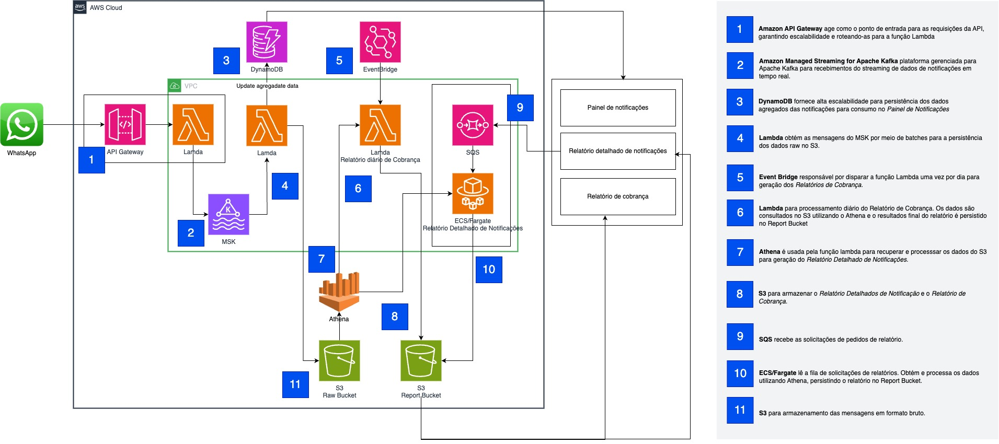
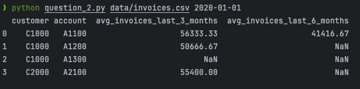
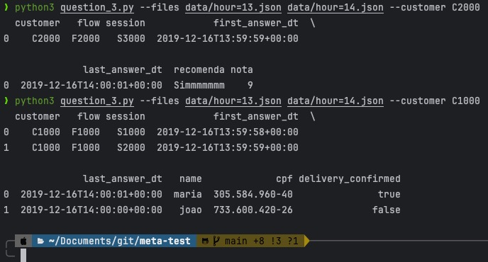

# meta-test

# Pré requisitos

- [Python](https://www.python.org/downloads/) 3.10+

# Configuração do ambiente

- [pip](https://pip.pypa.io/en/stable/cli/pip_install/) 24.3.1+

# Questão 1



## Princípios de Design Adotados

A arquitetura projetada atende aos requisitos do desafio proposto, integrando eficiência operacional, escalabilidade e custo-benefício. Abaixo detalho os princípios de design, a escolha dos serviços, e o impacto esperado pela implementação.

- **Escalabilidade**: O design projeto permite o aumento de demanda sem comprometimento da performance, utilizando serviços gerenciados como AWS Lambda, Amazon MSK e DynamoDB.
- **Modularidade**: Cada componente executa uma função específica, facilitando e permitindo a manutenção e operação da solução.
- **Custo-efetividade**: O uso de serviços gerenciados e sob demanda reduz custos fixos e otimiza recursos.
- **Tolerância a Falhas**: Com a adoção de soluções como Amazon SQS e S3, a arquitetura é resiliente a falhas temporárias.
- **Processamento em Tempo Real e Batch**: A integração de MSK e Lambda garante processamento contínuo para diferentes casos de uso.
- **Abordagem Serverless**: paradigma serverless para simplificar a gestão da infraestrutura e oferecer escalabilidade automática.

# Questão 2

```sh
python question_2.py data/invoices.csv 2020-01-01
```

Output: 



# Questão 3

```sh
python3 question_3.py --files data/hour=13.json data/hour=14.json --customer C2000
```

```sh
python3 question_3.py --files data/hour=13.json data/hour=14.json --customer C1000
```

